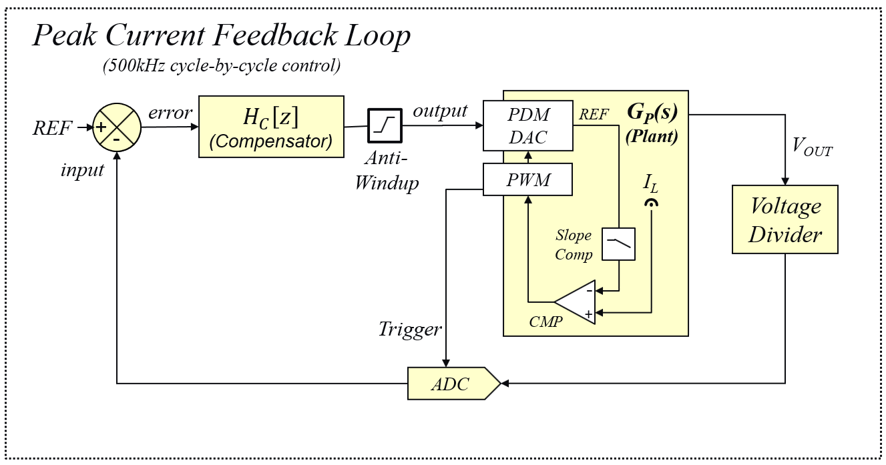
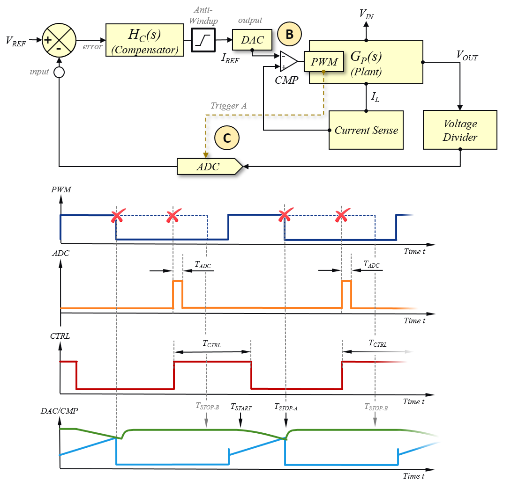

# Power Supply Control

  <!-- start tag for internal references -->

    

## Table of Contents

- [DPSK3 Buck Converter Peak Current Mode Control Loop Implementation](#pcmc_1)
- [Control Loop Block Diagram](#pcmc_2)
- [Control Loop Timing](#pcmc_3)
- [Control Loop Flow Chart](#pcmc_4)
- [Control Loop Firmware Implementation](#pcmc_5)

## 1) DPSK3 Buck Converter Peak Current Mode Control Loop Implementation

This firmware demonstrates the implementation of a simple, single loop peak current mode controller used to regulate the constant output voltage of the on-board step-down converter of the Digital Power Starter Kit 3 (DPSK3). The implementation of the Voltage Feedback Loop requires one Analog-to-Digital Converter (ADC) input oversampling the output voltage of the converter and two PWM outputs (PWM high and PWM low) to drive the power converter half-bridge switch node in synchronous mode. The current feedback is generated by a current sense transformer, providing the positive slope of the triangular inductor current to an analog on-chip comparator. If the current feedback signal exceeds the internally applied reference signal, the comparator trips the PWM logic, truncating the active on-time.

[[back](#startDoc)]

## 2) Control Loop Block Diagram

*Figure 1* shows the block diagram of the buck converter peak current mode controller, where the ADC input is used to sample the most recent level of the output voltage feedback signal. Once converted, the value is then compared against the internal reference value and the inverse of the deviation between reference and feedback (= *error*) is pushed through the discrete compensation filter. 

In the Anti-Windup block, the output of the compensation filter is checked against user-specified minimum and maximum thresholds. Should any of these thresholds be exceeded, the controller output will be overwritten with the respective threshold value before being written directly to the Digital-to-Analog Converter (DAC) register applying the reference to the internal comparator. The comparator output is triggering the PWM logic when the inductor current feedback exceeds teh reference, which will terminate the active on-time (output PWMxH going low).

    
     <i>Figure 1: Control Loop Block Diagram</i> 

 

#### Light Load Syncronous Rectifier Control

Light load operation of the controller implementation used in this code example observes the most recent control output written to the DAC providing the reference voltage to the switch-node comparator. This reference level represents the desired peak current of the inductor current and therefore relates to the power output of the converter. Below a certain threshold, the switching losses created by operating the low-side rectifier FET exceed the power loss savings gained by operating a FET instead of a passive rectifier diode. Below this power level the low-side FET is therefore turned off using its body diode to rectify the current, effectively switching the synchronous buck converter into asynchronous operation.

As a result, the duty ratio may drop to zero until the converter ends up in burst mode operation under no-load conditions, where a sequence of short pulses is generated to recharge the output capacitor. As soon as the control loop produces a DAC value grater than the user-defined threshold, the converter will switch back into synchronous operation for improved efficiency in continuous conduction mode.

[[back](#startDoc)]
 

## 3) Control Loop Timing

The single, outer voltage loop controller is triggered by the PWM counter at the same time as the ADC is triggered. The control loop is executing the overhead code of calculating the first part of the compensation filter term (= *A-Term*) until the most recent ADC sample is available to be processed in the later part of the compensation filter term computation (= *B-Term*). This approach helps to shorten the overall response time of the controller measured between ADC trigger and write back event of the most recent controller result to the DAC register. The ADC trigger point is positioned towards the end of the period leaving enough room for the computation to complete before the next cycle end is expected. By placing the ADC trigger point as late as feasible within the period, the total control response time is less than half a switching period, resulting in minimized phase erosion.

    
     <i>Figure 2: Control Loop Timing</i> 

 

[[back](#startDoc)]

## 4) Control Loop Flow Chart

*Figure 3* shows a typical flow chart of a discrete software feedback loop called at the desired control frequency. It covers the loop path from ADC trigger to DAC update shown in the block diagram above (see *Figure 2*) while supporting additional features like an *Enable/Disable Bypass Switch*.

-  <b>[green]</b> boxes represent default building blocks
-  <b>[grey]</b>  boxes represent unused optional features
-  <b>[blue]</b>  boxes represent active optional features

    
     <i>Figure 3: Control Loop Flow Chart</i> 

 
<!---
 
The compensation filter is based on an Infinite-Impulse-Response (IIR) filter computation, which breaks into two elements:
-->

[[back](#startDoc)]

## 5) Control Loop Firmware Implementation

*Figure 4* shows a typical implementation of the power converter state machine and the high-speed control loop in a task scheduler based firmware environment.

-  <b>Real Time Control Loop and Low Level Drivers</b> 
The control loop is called in an independent high priority Interrupt Service Routine (ISR) by the PWM module simultaneously with triggering the ADC input. Thus, the control loop is tightly coupled to the PWM switching signal and synchronized to the most recent ADC conversion process, allowing a highly deterministic arrangement of code execution, peripheral module activity and external analog circuit operation. The interrupt priority needs to be high enough to override all other software tasks of the firmware to ensure jitter-free execution of the control loop.
  
-  <b>Topology-Specific State Machine Library</b>
Each converter topology requires a specifically tailored configuration of related chip resources as well as start-up, control and monitoring procedures. *Topology State Machine Libraries* support a wide range of circuit configurations, control modes and functional features. Build-in peripheral configuration drivers are used to ease the configuration of required chip resources, such as number of PWM channels and their signal configuration, number of Analog-to-Digital (ADC) inputs, analog comparators, Digital-to-Analog Converter (DAC) channels, etc.
All user configurations of a topology specific power converter are encapsulated in a comprehensive data object. This approach allows the definition of multiple power supplies of the same type being included, monitored and run independently from each other. Each of these power converter objects also include the declaration of the high-speed control loop object described above, enabling it to control peripherals and control loop code to be synchronized to time-critical states.
  
-  <b>Application Layer of the Power Supply Control Task</b> 
The application layer of this task is the proprietary firmware component covering the application-specific configuration of library data objects and high-speed control loops. It also allows to add and tailor functions, which are not covered by the default features of library modules.
  
-  <b>Scheduler Level</b> 
The scheduler level organizes all tasks of the firmware. Besides the power control and related fault handler task, this DPSK3 code example includes the on-board LC display data output, the on-board push-button control of the LC display screens and the on-board debugging LED, which are considered less time critical, low-priority tasks. The main task scheduler in this firmware example therefore supports two priority levels, one for power control and fault handling, executed at a rate of 10 kHz (= 100 us interval) and the low priority tasks, executed at rates between 0.5 ms and 250 ms.
  

    
     <i>Figure 4: Control Loop Firmware Implementation</i> 

    
More detailed information on the library implementation, such as task and library APIs, can be found in the chapter *Software Overview* on the left side of this window.

[[back](#startDoc)]

_________________________________________________
(c) 2021, Microchip Technology Inc.
