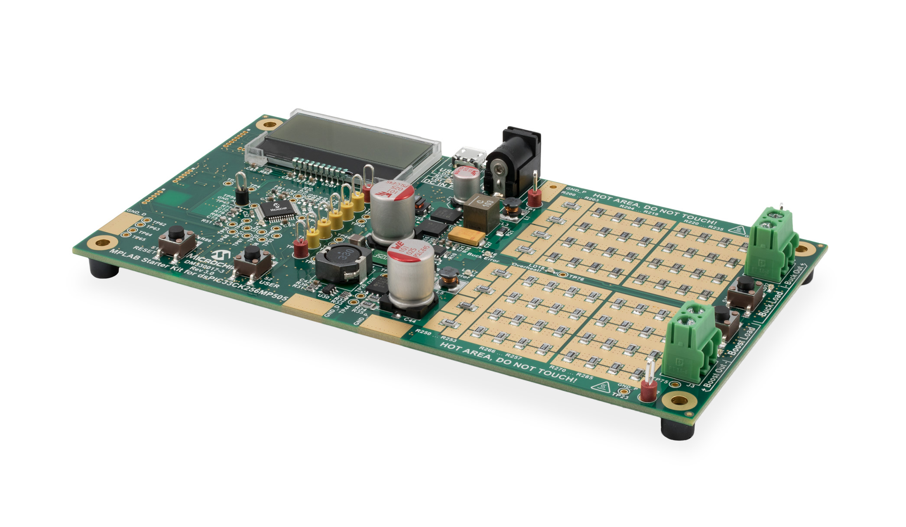

 

# dsPIC33C Digital Power Starter Kit
**Synchronous Buck Converter: Voltage Mode Control**

- - -

## Summary
Voltage mode control example for the buck converter on the Digital Power Starter Kit, version 3 (DPSK3) featuring the dsPIC33CK family of devices.

- - -

## Related Documentation
- [dsPIC33CK256MP508 Family Data Sheet](https://ww1.microchip.com/downloads/en/DeviceDoc/dsPIC33CK256MP508-Family-Data-Sheet-DS70005349G.pdf)
- [dsPIC33CK256MP508 Family Silicon Errata and Data Sheet Clarification](https://ww1.microchip.com/downloads/en/DeviceDoc/dsPIC33CK256MP508-Family-Silicon-Errata-and-Data-Sheet-Clarification-DS80000796G.pdf)

**Please always check for the latest data sheets on the respective product websites:**
- [dsPIC33CK256MP508 Family](https://www.microchip.com/dsPIC33CK256MP508)
- [dsPIC33CH512MP508 Family](https://www.microchip.com/dsPIC33CH512MP508)

## Software Used 
- [MPLAB® X IDE v5.40](https://www.microchip.com/mplabx-ide-windows-installer)
- [MPLAB XC16 Compiler v1.60](https://www.microchip.com/mplabxc16windows)
- [Microchip Code Configurator v4.0.1](https://www.microchip.com/mplab/mplab-code-configurator)

## Hardware Used
- dsPIC33C Digital Power Starter Kit, Part-No. [DM330017-3](https://www.microchip.com/DM330017-3)

## Supported Target Devices
- 48-pin [dsPIC33CK256MP505](https://www.microchip.com/dsPIC33CK256MP505)

- - -

## Setup
- Connect dsPIC33C Digital Power Starter Kit to the PC using the micro-USB cable
- Open and compile the firmware; program the target device
- Attach the 9V power supply to the board and observe the real-time values on the LC display

 

## Operation
After the device has been programmed and the target device starts up, the LC display will show the startup screen for approx. 2 seconds before switching to the runtime data display, showing the most recent input and output voltages.
In case an appropriate power supply has been attached to the DPSK3 power input and the firmware is running correctly, the display should show an output voltage of +3.30V. 
When pressing the on-board button USER for one second or longer, the screen can be switched between:

- Output Voltage View
- Temperature View
- Output Current View

By pressing the Buck Load on-board button on the right edge of the board, users can change the load level:

- no LED:  0% (0 mA)
- 1 LEDs: 10% (100 mA)
- 2 LEDs: 25% (500 mA)
- 3 LEDs: 50% (1000 mA)

<!--
 

 
*200 kHz Switching Frequency Output*

By pressing the on-board push button *USER* on the Digital Power Development Board, the switching frequency is toggled between the initial 200 kHz and 1 MHz.
 

 
*1 MHz Switching Frequency Output*
-->

Please refer to section *FIRMWARE QUICK-START GUIDE* below for more information on the initialization process and code structure.
 
- - -

## FIRMWARE QUICK-START GUIDE

<add description>

*a) Project Directory Structure*
The project contains two sub-directories
- config: location of all hardware abstraction header files
- common: all device configuration files auto-generated by MCC
- drivers: location of generic peripheral drivers 
- tasks: application user code

On the hard drive, main.c/h are located in the MPLAB X project directory. 
All other user files, incl. peripheral drivers, are located in the sub-directory *sources*. 
Files generated by MCC are always located in their own sub-directory *mcc_generated-files* 

*b) Modifying Operating Parameters*
The PWM peripheral driver files p33c_pwm.c/h provide data structures representing the Special Function Register (SFR) sets of PWM generators and the PAM base module. These 'virtual' PWM objects are used to load, read and modify PWM generator configurations without the need to hard-coded instructions, which would make the code hard to migrate from one peripheral to another or even across devices.
To simplify PWM configurations, in these examples, each register is reset to a known default state before the user configuration of interest is set. Thus, only the register setting which really matter for a certain features/function are shown.

To learn more about the generic PWM driver, its supported features and intended use cases, please read the comments inside p33c_pwm.c.

*c) Executing the Code Example*
This code has been written to automatically start up and perform the function of interest. Please read the demo instructions on top of file main.c to learn more about the code example, test points, expected signals and demo mode operation.

- - - 

© 2020, Microchip Technology Inc.
